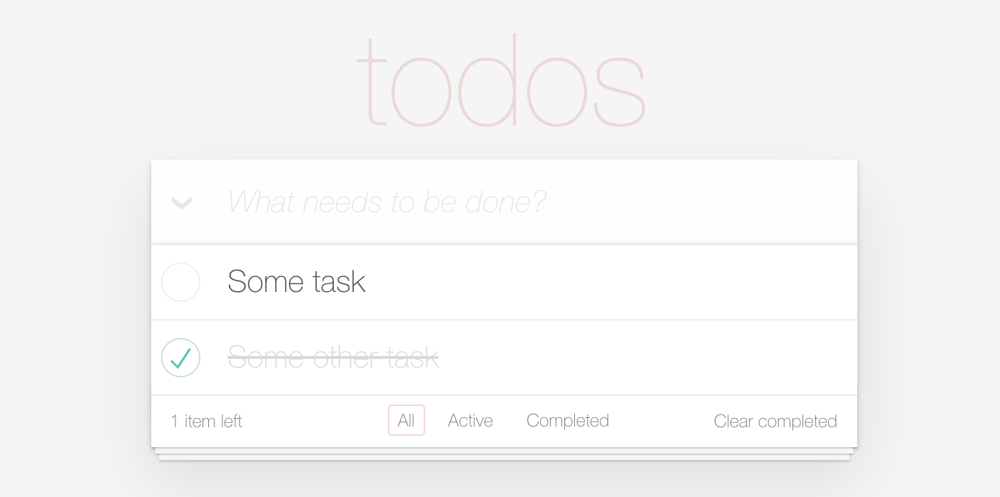

# ✅  Create a Simple Todo List Application



Complete a full-stack implementation in Spring Boot and React to support the following functionality in 4 hours. The tooling is in place and requires Java 11, Gradle, NodeJS, and Yarn.

An ideal submission would have a:

1.  Minimally complete API to facilitate the requirements of the client 
2.  Minimally complete Todo List view to support the functionality listed below.
3.  Reasonable test coverage on both the API and UI
### Testing `backend`:
```sh
cd todo-server;./gradlew clean build test
```
### Testing `frontend`:
```sh
cd todo-client;yarn  test
```

**We understand that this is a short time window and don't expect a fully completed application**. 
We'd prefer not to take up more than 4 hours of your time, so no need for extensive styling; we are more
concerned with the foundational criteria mentioned above. If you aren't able to finish everything, 
no problem, we can discuss how you'd finish when we review it together 🙂

## Set Up

This should work cross-platform, but ideally should be used in a Linux, or Unix environment. 
If you are unable to install the following, please continue implementing the logic to the best of your 
ability and let us know in the review.

### Install SDK-Man Version Manager
1. Open a terminal
2. Enter `curl -s "https://get.sdkman.io" | bash`
3. Using SDK-Man, run the following commands to download:
    - Java-11 JDK: `sdk install java 11.0.8-amzn`
4. You can use jenv to set your java environment version if you have multiple Java versions installed
5. Install [nvm - Node Version Manager](https://github.com/nvm-sh/nvm) and install the current LTS version by running the following commands:

### Install `nvm`:
```sh
curl -o- https://raw.githubusercontent.com/nvm-sh/nvm/v0.37.2/install.sh | bash
```

### Add export to `~/.bash_profile` or  `~/.zshrc`
```sh
export NVM_DIR="$([ -z "${XDG_CONFIG_HOME-}" ] && printf %s "${HOME}/.nvm" || printf %s "${XDG_CONFIG_HOME}/nvm")"
[ -s "$NVM_DIR/nvm.sh" ] && \. "$NVM_DIR/nvm.sh" # This loads nvm
```

### Install `NodeJS` LTS Version
```sh
# Open a new terminal (to pick up the .zshrc changes for nvm) or source bash profile and run
nvm install --lts
```

### Install `yarn`
```sh
npm install --global yarn
```

### Install `concurrently`
```sh
npm install --global concurrently
```

### Install `react`
```sh
npm install -global react
```

### Install `react-scripts`
```sh
npm install -global react-scripts
```
### Install `eslint-plugin-cypress`
```sh
npm install -global eslint-plugin-cypress --save-dev
```

### Update `libs in todo-client`
```sh
cd todo-client;npm update; cd ..
```

### Check out the repository
```sh
git clone git@bitbucket.org:hockey_dave/fullstackassessment.git`
```

### Create a new branch from master branch with your name 
```sh
git checkout -b assessment/<first>-<last>
```

### Run the startup script

Navigate your shell to the project directory and run  `./run.sh` to run and tail logs for both client and server.

### Notes
- The server run will on `localhost:8080`
- Webpack Dev Server should launch automatically in the default browsers at `localhost:3000`
- The GUI for the H2 in-memory database can be found at `localhost:8080/todo-db`.
    - To connect, replace the `JDBC URL` with `jdbc:h2:mem:todo`, there is no password and the default user `sa` should be left intact.
- If you are using intellij, use the guide (displayed below for your convenience) [following](https://stackoverflow.com/a/45640726) to enable classpath reloading:
    -  Enable **"Build project automatically"** from Settings->Build, Execution, Deployment->Compiler
    -  Go to Registry(CMD-Shift-O, navigate to actions, and type "Registry") and enable **compiler.automake.allow.when.app.running** and **ide.windowSystem.autoShowProcessPopup**
    
If all loads, you should be good to go 👍

## Functional Requirements 

### If there are no todos in your list

When there are no todos, `#main` and `#footer` should be hidden.

### Creating a new todo

New todos are entered in the input at the top of the app. The input element should be focused when the page is loaded,
preferably by using the `autofocus` input attribute. Pressing Enter creates the todo, appends it to the todo list,
and clears the input. Make sure to `.trim()` the input and then check that it's not empty before creating a new todo.

### Mark all as complete

This checkbox toggles all the todos to the same state as itself. Make sure to clear the checked state after the
"Clear completed" button is clicked. The "Mark all as complete" checkbox should also be updated when single todo
items are checked/unchecked. E.g. When all the todos are checked it should also get checked.

### Item

A todo item has three possible interactions:

1. Clicking the checkbox marks the todo as complete by updating its `completed` value and toggling the class `completed` on its parent `<li>`

2. Double-clicking the `<label>` activates editing mode, by toggling the `.editing` class on its `<li>`

3. Hovering over the todo shows the remove button (`.destroy`)

### Editing

When editing mode is activated it will hide the other controls and bring forward an input that contains the todo title,
which should be focused (`.focus()`). The edit should be saved on both blur and enter, and the `editing` class should
be removed. Make sure to `.trim()` the input and then check that it's not empty. If it's empty the todo should instead
be destroyed. If escape is pressed during the edit, the edit state should be left and any changes be discarded.

### Counter

Displays the number of active todos in a pluralized form. Make sure the number is wrapped by a `<strong>` tag. 
Also make sure to pluralize the `item` word correctly: `0 items`, `1 item`, `2 items`. Example: **2** items left

### Clear completed button

Removes completed todos when clicked. Should be hidden when there are no completed todos.

### Persistence

Your app should dynamically persist the todos to localStorage, or if you have time, you can add API support with `axios`
and Webpack Dev Server proxying to `localhost:8080`. Make sure to use this format for the localStorage name:
`todos`. Editing mode should not be persisted.

### Routing

Routing is required for all implementations. The following routes should be implemented: `#/` (all - default),
`#/active` and `#/completed` (`#!/` is also allowed). When the route changes, the todo list should be filtered
on a model level and the `selected` class on the filter links should be toggled. When an item is updated while
in a filtered state, it should be updated accordingly. E.g. if the filter is `Active` and the item is checked,
it should be hidden. Make sure the active filter is persisted on reload.

## Submissions

When you are finished, push your commits to the remote.
